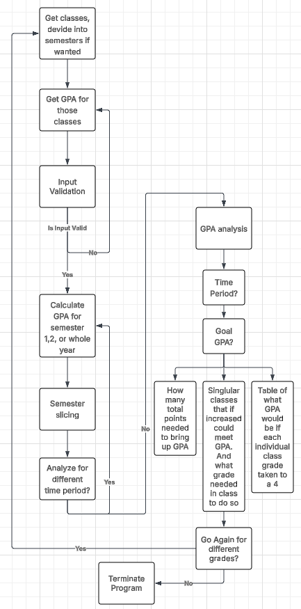

<h1 style="text-align: center">Dylan Soule's Verbose GPA Calculator</h1>

This program is a terminal run GPA(Grade Point Average) calculator and analyzer that not only allows you to compute your GPA for an individual semester or the whole year, but also calculates needed improvement to specific classes in order to meet a goal GPA.  
And the calculator does it while guiding you through the whole process using words instead of you having to figure out where to put values in a spreadsheet or something boring like that!

## Installation
### Requirements
* Python 3
* A terminal or code software to run program
### How to Install and run
* Download the [gpa_calculator.py](gpa_calculator.py) file
* Then to run the file, cd into the directory that the file is in, or specify the whole path and run the gpa_calculator.py file in your terminal using python three
```bash
$ python3 [path to directory]/gpa_calculator.py
```
## How the program works
### A quick description
The calculator will allow you to specify any number of classes for both your first and second semesters(including 0 if you don't what to analyze a semester or haven't yet taken it).  
During this process you will be able to name each class that you have and the current grade in the class(0-4).  
Once you have defined your classes and your grade in each of them, then you can start the GPA analysis

You will be prompted with whether you would like to view your current GPA for either your first semester, second semester or whole year. Once you have answered this the program will then calculate that request.  
You have the chance to repeat this calculation as many times as you would like in case you want to view a different time period or view your GPA again

After that comes the coolest part of the program, the GPA analysis. Just like the calculation you have the option to pick if you want to analyze just the first or second semesters or the whole year. Either way once you pick what times period you want to analyze you will then be prompted with a goal GPA that you would like to reach, enter your desired value.  
Once you have done this the program will work its magic, and tell you how many points total you need to increase your classes(Ex. 8 points, this could be distributed over all your classes such as 1 point increase in math, 3 in English, 2 in Science, and 2 in History), if you can reach your goal by improving your grade in any one class, and what you would need to improve it to in order to get to that, and finally what your GPA would be if you improved any one class to a 4.

### An example use of the program
* Begin by running the program
```bash
python3 gpa_calculator.py
```
* Then you are prompted with how many classes you took in semester one(If you didn't take any or didn't take a semester one put 0)
* Example with 5 classes
```
How many classes did you have in semester one?(Number Only) 5
```
* You will then be asked to provide names for all the classes, and your grade in those classes(0-4)
```
What is your class is your period number 1 in semester one? Math
What is your grade in that class?(0.00-4.00) 3.25

What is your class is your period number 2 in semester one? English
What is your grade in that class?(0.00-4.00) 3.8

What is your class is your period number 3 in semester one? Science
What is your grade in that class?(0.00-4.00) 4

What is your class is your period number 4 in semester one? Computer Science 
What is your grade in that class?(0.00-4.00) 2.5

What is your class is your period number 5 in semester one? History
What is your grade in that class?(0.00-4.00) 3 
```
* The Same will be repeated for semester 2
```
How many classes did you have in semester two?(Number Only) 5

What is your class number 1 for semester two? Math
What is your GPA in that class?(0.00 - 4.00) 3

What is your class number 2 for semester two? Science
What is your GPA in that class?(0.00 - 4.00) 3.2

What is your class number 3 for semester two? English
What is your GPA in that class?(0.00 - 4.00) 3.75

What is your class number 4 for semester two? Computer Science
What is your GPA in that class?(0.00 - 4.00) 2.89

What is your class number 5 for semester two? History
What is your GPA in that class?(0.00 - 4.00) 3.9
```
* You will then be prompted with how you would like to view your GPA, either semester one, semester two, or the whole year
* For this example we will only deal with semester one, however the same applies to either semester two or the whole year
```
How would you like to view your gpa(Semester 1/Semester 2/Whole year) Semester 1

Your GPA for Semester 1 is 3.31

Would you like to calculate another type(yes/no) no
```
* Once you are done with GPA viewing you will then be asked if you would like to analyze your grades, by proceeding with yes you can once again pick what time period you would like to do analysis on, and then input goal GPA for that period
```
Would you like to analyze for improvement(yes/no) yes

How would you like to analyze your gpa(Semester 1/Semester 2/Whole year) Semester 1
What is your goal GPA? 3.5
```
* The program will then output the points needed to meet your goal distributed over all classes
* Below this, the program will output individual classes that you can improve to meet your goal GPA
```
Throughout all of your classes, you need to add 0.95 points to your classes

Great News! If you change your Computer Science class grade from a 2.5 to a 3.45 you will meet your goal GPA
Great News! If you change your History class grade from a 3.0 to a 3.95 you will meet your goal GPA
```
* You will also be given a table that shows what your total GPA for the time period you specified would be if you changed any one class from your current grade to a 4.0(The max)
```
In addition, this is what gpa you will get if you change any one class to a 4.0:
Class                    Current Grade                 Improved Grade      Current GPA                   Improved GPA
Math                     3.25                -->       4.0                 3.31                -->       3.46
English                  3.8                 -->       4.0                 3.31                -->       3.35
Science                  4.0                 -->       4.0                 3.31                -->       3.31
Computer Science         2.5                 -->       4.0                 3.31                -->       3.61
History                  3.0                 -->       4.0                 3.31                -->       3.51
```
* You will then be prompted with reanalyzing, either for the same time period or a different one
* If you don't, you will have the option to either end the program or repeat the whole cycle
```
Would you like to analyze a different type(yes/no) no

Would you like to analyze a different GPA or changed GPA(yes/no) no
Thanks for working on improving your GPA with me, hopefully you come again soon with higher grades
```
### Program Flow
